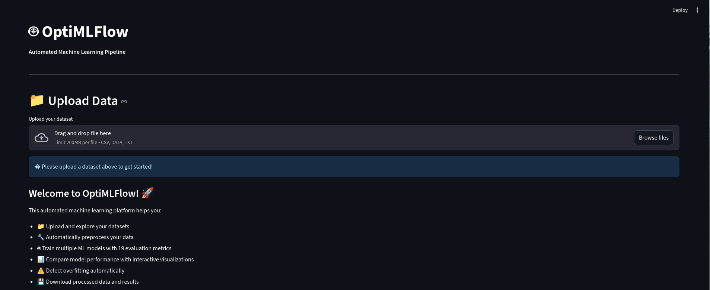
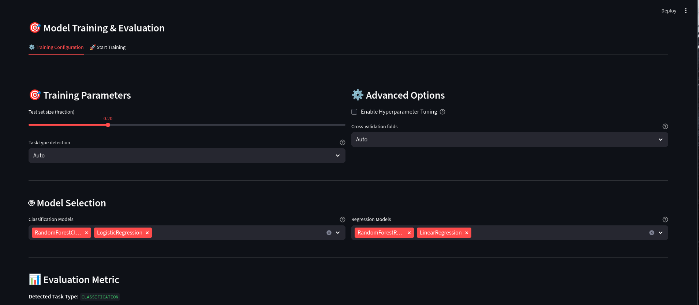
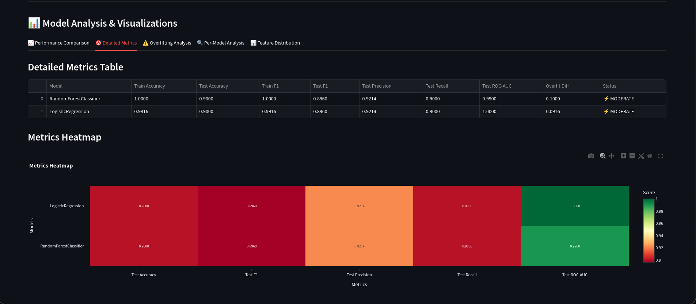

# 🤖 OptiMLFlow

**Automated Machine Learning Pipeline with Advanced Model Evaluation**

OptiMLFlow is a comprehensive, modular machine learning platform built with Streamlit that automates the entire ML workflow from data preprocessing to model evaluation and comparison.

## ✨ Features

### 🎯 Core Capabilities

- **Automated Data Preprocessing**: Smart handling of numerical and categorical features
- **Multiple ML Models**: Train and compare 21+ supervised and unsupervised models simultaneously
- **Hyperparameter Tuning**: Optional GridSearchCV optimization for best model performance
- **22 Evaluation Metrics**: Comprehensive metrics for classification, regression, and clustering tasks
- **Overfitting Detection**: Automatic detection with 3-tier warning system (✓ GOOD, ⚡ MODERATE, ⚠️ HIGH)
- **Interactive Visualizations**: 5 tabbed visualization dashboards with Plotly charts
- **Unsupervised Learning**: K-Means and DBSCAN clustering with automatic quality metrics
- **🎨 Theme Switcher**: Toggle between Light ☀️ and Dark 🌙 modes for comfortable viewing

### 📊 Supported Models

**Classification (15+ models):**

- **Ensemble Methods:**
  - Random Forest Classifier
  - Gradient Boosting Classifier
  - AdaBoost Classifier
  - XGBoost Classifier (XGBClassifier)
  - LightGBM Classifier (LGBMClassifier)

- **Linear Models:**
  - Logistic Regression

- **Probabilistic:**
  - Gaussian Naive Bayes

- **Support Vector Machines:**
  - Support Vector Classifier (SVC)

- **Instance-Based:**
  - K-Nearest Neighbors Classifier

- **Tree-Based:**
  - Decision Tree Classifier

**Regression (14+ models):**

- **Ensemble Methods:**
  - Random Forest Regressor
  - Gradient Boosting Regressor
  - AdaBoost Regressor
  - XGBoost Regressor (XGBRegressor)
  - LightGBM Regressor (LGBMRegressor)

- **Linear Models:**
  - Linear Regression

- **Support Vector Machines:**
  - Support Vector Regressor (SVR)

- **Instance-Based:**
  - K-Nearest Neighbors Regressor

- **Tree-Based:**
  - Decision Tree Regressor

**Clustering (2 unsupervised models):**

- **Partitioning Methods:**
  - K-Means Clustering

- **Density-Based:**
  - DBSCAN (Density-Based Spatial Clustering of Applications with Noise)

### 📈 Evaluation Metrics

**Classification (10 metrics):**

- Accuracy
- Balanced Accuracy
- F1 Score (standard, macro, micro)
- Precision
- Recall
- ROC-AUC
- Matthews Correlation Coefficient
- Cohen's Kappa

**Regression (9 metrics):**

- R² Score
- Adjusted R²
- Mean Absolute Error (MAE)
- Mean Squared Error (MSE)
- Root Mean Squared Error (RMSE)
- Mean Absolute Percentage Error (MAPE)
- Median Absolute Error
- Max Error
- Explained Variance

**Clustering (3 metrics):**

- Silhouette Score - Measures cluster cohesion and separation (higher is better)
- Davies-Bouldin Index - Average similarity ratio of clusters (lower is better)
- Calinski-Harabasz Index - Variance ratio criterion (higher is better)

## 🚀 Quick Start

### Installation

1. **Clone the repository:**

```bash
git clone https://github.com/Et18n/OptiMLFlow.git
cd OptiMLFlow
```

2. **Create a virtual environment:**

```bash
python -m venv .venv
source .venv/bin/activate  # On Windows: .venv\Scripts\activate
```

3. **Install dependencies:**

```bash
pip install -r requirements.txt
```

### Running the Application

```bash
streamlit run app_modular.py
```

The application will open in your default web browser at `http://localhost:8501`

## Modal Anomaly Backend (Low-Cost Integration)

This project includes a dedicated Modal backend for anomaly model training and inference:

- Modal service file: `backend/modal_anomaly_service.py`
- Python client for Streamlit/local usage: `backend/modal_anomaly_client.py`
- Optional backend pass-through routes: `backend/main.py`

### Why this design is credit-efficient

- Local side keeps heavy preprocessing and feature engineering
- Modal only does model training and prediction
- CPU only (`cpu=1`), no GPU
- Lightweight Isolation Forest defaults (`n_estimators=64`, bounded to `50-100`)
- Training cooldown + lock to prevent repeated accidental retraining
- Strict payload limits for train/predict requests
- Hard limits: train <= 30,000 rows, predict <= 5,000 rows, max 256 features
- Training timeout enforced at 120 seconds on Modal
- Model persisted on Modal Volume and reused for inference

### Deploy the Modal service

1. Install dependencies and authenticate Modal:

```bash
pip install -r requirements.txt
modal setup
```

2. Deploy:

```bash
modal deploy backend/modal_anomaly_service.py
```

3. Copy the deployed base URL and configure environment variables:

```bash
export MODAL_ANOMALY_BASE_URL="https://<your-modal-url>"
export MODAL_ANOMALY_API_KEY=""  # optional if you protect the endpoint
export MODAL_ANOMALY_TIMEOUT_SECONDS="45"
```

### Modal API endpoints

- `POST /train`
- `POST /predict`
- `GET /health`

Training expects a preprocessed numeric matrix (`X`) and requires explicit manual confirmation:

```json
{
  "X": [
    [0.1, 1.2],
    [0.0, 0.8]
  ],
  "contamination": 0.05,
  "n_estimators": 64,
  "model_id": "default",
  "confirm_train": true,
  "force_retrain": false
}
```

Prediction expects the same feature format:

```json
{
  "X": [
    [0.2, 1.1],
    [3.4, 8.0]
  ],
  "model_id": "default"
}
```

### Python client usage (Streamlit-friendly)

```python
import os
import pandas as pd
from backend.modal_anomaly_client import ModalAnomalyClient

client = ModalAnomalyClient(base_url=os.environ["MODAL_ANOMALY_BASE_URL"])

# X_train_proc should already be preprocessed numeric features.
train_result = client.train(
    X_train_proc,
    contamination=0.05,
    n_estimators=64,
    model_id="default",
    confirm_train=True,
)

# Batch inference in one call for lower overhead.
predict_result = client.predict(X_inference_proc, model_id="default")

labels = predict_result["anomaly_labels"]
scores = predict_result["anomaly_scores"]
```

For a quick smoke run, see: `test_modal_anomaly_integration.py`

### Optional local backend proxy routes

If your frontend already talks to the FastAPI backend, use these routes:

- `POST /api/modal/anomaly/train`
- `POST /api/modal/anomaly/predict`
- `GET /api/modal/anomaly/health`

These proxy routes validate payload size before forwarding requests to Modal.

## Modal Generic ML Backend (Model-Agnostic)

This repo now also supports a generic Modal backend that can train and serve multiple ML task types:

- Classification
- Regression
- Anomaly Detection

### Generic files

- Service: `backend/modal_ml_service.py`
- Client: `backend/modal_ml_client.py`
- Smoke test: `test_modal_ml_integration.py`

### Deployment

```bash
modal deploy backend/modal_ml_service.py
```

Set environment variables for local proxy/client usage:

```bash
export MODAL_ML_BASE_URL="https://<your-modal-url>"
export MODAL_ML_API_KEY=""  # optional
export MODAL_ML_TIMEOUT_SECONDS="45"
```

### Modal API endpoints

- `POST /train`
- `POST /predict`
- `GET /health`

### Training payload (generic)

```json
{
  "X": [
    [0.1, 1.2],
    [0.4, 0.6]
  ],
  "y": [0, 1],
  "task_type": "classification",
  "model_type": "logistic_regression",
  "confirm_train": true,
  "force_retrain": false
}
```

`y` is required for `classification` and `regression`, and optional for `anomaly`.

### Prediction payload

```json
{
  "model_id": "<model_id>",
  "X": [
    [0.2, 1.0],
    [0.6, 0.3]
  ]
}
```

### Client usage

```python
from backend.modal_ml_client import train_model, predict

train_result = train_model(
    X=X_train_proc,
    y=y_train,
    task_type="classification",
    model_type="logistic_regression",
)

model_id = train_result["model_id"]
pred_result = predict(model_id, X_test_proc)
```

The generic client exposes exactly:

- `train_model(X, y, task_type, model_type)`
- `predict(model_id, X)`

### Optional backend proxy endpoints

If your frontend calls FastAPI first, use:

- `POST /api/modal/ml/train`
- `POST /api/modal/ml/predict`
- `GET /api/modal/ml/health`

## 📖 User Guide

### Step-by-Step Workflow

1. **Upload Your Dataset**
   - Supports CSV, TXT, and DATA file formats
   - Automatic separator detection for .data files
   - Manual separator configuration available

2. **Explore Your Data**
   - View dataset preview and statistics
   - Analyze data overview charts
   - Examine target variable distribution

3. **Select Target Column**
   - Choose your prediction target from the dropdown

4. **Configure Training** (Training Configuration Tab)
   - Set train/test split ratio (10% - 50%)
   - Choose task type (Auto-detect, Classification, or Regression)
   - Select models to train
   - Enable hyperparameter tuning (optional)
   - Configure cross-validation folds
   - **Choose optimization metric** from 19 options

5. **Train Models** (Start Training Tab)
   - Review configuration summary
   - Click "Train Models Now"
   - Monitor preprocessing and training progress
   - Download processed datasets

6. **Analyze Results**
   - **Performance Comparison**: Side-by-side model comparison with charts
   - **Detailed Metrics**: Complete metrics table and heatmap visualization
   - **Overfitting Analysis**: Train vs test comparison and gap analysis
   - **Per-Model Analysis**: Deep dive into individual model performance with radar charts
   - **Feature Distribution**: Explore feature distributions in your dataset

## 🏗️ Project Structure

```
OptiMLFlow/
├── app_modular.py              # Main Streamlit application
├── requirements.txt            # Python dependencies
├── core/                       # Core modules
│   ├── __init__.py            # Package initialization
│   ├── ui_components.py       # Streamlit UI components
│   ├── file_handler.py        # File upload and validation
│   ├── preprocessing.py       # Data preprocessing pipeline
│   ├── model_training.py      # ML model training and evaluation
│   └── chart_generator.py     # Plotly visualization functions
└── Datasets/                  # Sample datasets
    ├── car_sales_data.csv
    ├── disease_diagnosis.csv
    ├── HR_Data_MNC_Data Science Lovers.csv
    ├── student_exam_scores.csv
    ├── winequality-red.csv
    └── winequality-white.csv
```

## 🔧 Technical Details

### Modular Architecture

The application follows a clean modular design:

- **`ui_components.py`**: All Streamlit UI elements and user interactions
- **`file_handler.py`**: File loading, validation, and metadata extraction
- **`preprocessing.py`**: Feature engineering, encoding, scaling, and train/test splitting
- **`model_training.py`**: Model initialization, training, hyperparameter tuning, and metric calculation
- **`chart_generator.py`**: All Plotly visualization generation functions

### Preprocessing Pipeline

- **Numerical Features**: Standard scaling with StandardScaler
- **Categorical Features**: One-hot encoding with OneHotEncoder
- **Missing Values**: Automatic handling (mean imputation for numerical, mode for categorical)
- **Train/Test Split**: Stratified splitting for classification tasks

### Hyperparameter Tuning

When enabled, GridSearchCV optimizes parameters for each model type:

**Ensemble Methods:**

- **Random Forest:** `n_estimators` [100, 200], `max_depth` [None, 5, 10]
- **Gradient Boosting:** `n_estimators` [100, 200], `learning_rate` [0.05, 0.1]
- **AdaBoost:** `n_estimators` [50, 100], `learning_rate` [0.5, 1.0]
- **XGBoost:** `n_estimators` [100, 200], `max_depth` [3, 5, 7], `learning_rate` [0.01, 0.1, 0.3]
- **LightGBM:** `n_estimators` [100, 200], `max_depth` [3, 5, 7], `learning_rate` [0.01, 0.1, 0.3]

**Linear Models:**

- **Logistic Regression:** `C` [0.1, 1, 10]
- **Linear Regression:** No tuning (uses defaults)

**Support Vector Machines:**

- **SVC/SVR:** `C` [0.1, 1, 10], `kernel` ['rbf', 'linear'], `gamma` ['scale', 'auto']

**Instance-Based:**

- **K-Nearest Neighbors:** `n_neighbors` [3, 5, 7], `weights` ['uniform', 'distance']

**Tree-Based:**

- **Decision Tree:** `max_depth` [None, 5, 10, 15], `min_samples_split` [2, 5, 10]

**Probabilistic:**

- **Gaussian Naive Bayes:** No tuning (uses defaults)

**Clustering (Unsupervised):**

- **K-Means:** `n_clusters` [2, 3, 4, 5, 6], `init` ['k-means++', 'random'], `max_iter` [300, 500]
- **DBSCAN:** `eps` [0.3, 0.5, 0.7, 1.0], `min_samples` [3, 5, 10], `metric` ['euclidean', 'manhattan']

### Model Recommendations by Use Case

**High Performance & Accuracy:**

- XGBoost (best for most tasks)
- LightGBM (faster, similar performance to XGBoost)
- Random Forest (robust, good baseline)

**Fast Training:**

- Naive Bayes (very fast, good for text/probabilistic data)
- Decision Tree (fast, interpretable)
- K-Nearest Neighbors (no training phase)

**Interpretability:**

- Logistic/Linear Regression (clear coefficients)
- Decision Tree (visual rules)

**Unsupervised Learning / Pattern Discovery:**

- K-Means (fast, works well with spherical clusters, requires specifying number of clusters)
- DBSCAN (finds arbitrary-shaped clusters, automatically detects outliers, no need to specify cluster count)
- Naive Bayes (probabilistic interpretation)

**Non-Linear Patterns:**

- SVM with RBF kernel (complex decision boundaries)
- XGBoost/LightGBM (captures interactions)
- Neural Networks (for future implementation)

**Small Datasets:**

- Naive Bayes (works well with limited data)
- SVM (effective in high dimensions)
- Logistic Regression (prevents overfitting)

**Large Datasets:**

- LightGBM (optimized for speed and memory)
- XGBoost (distributed computing support)
- Linear models (scale well)

### Overfitting Detection

Automatic detection based on train-test performance gap:

- **✓ GOOD**: < 5% difference
- **⚡ MODERATE**: 5% - 10% difference
- **⚠️ HIGH**: > 10% difference

## 📊 Sample Datasets

The `Datasets/` folder includes sample datasets for testing:

1. **car_sales_data.csv**: Car sales prediction (regression)
2. **disease_diagnosis.csv**: Disease classification (classification)
3. **HR_Data_MNC_Data Science Lovers.csv**: Employee attrition prediction (classification)
4. **student_exam_scores.csv**: Exam score prediction (regression)
5. **winequality-red.csv**: Red wine quality prediction (regression/classification)
6. **winequality-white.csv**: White wine quality prediction (regression/classification)

## 🎨 Screenshots

### Main Interface



### Training Configuration



### Visualization Dashboard



## 🛠️ Technologies Used

- **Streamlit**: Web application framework
- **scikit-learn**: Machine learning algorithms and preprocessing
- **XGBoost**: Gradient boosting framework
- **LightGBM**: Fast gradient boosting framework
- **Plotly**: Interactive visualizations
- **Pandas**: Data manipulation and analysis
- **NumPy**: Numerical computing

## 🔮 Future Enhancements

**Planned Models:**

- **Neural Networks**: Multi-layer Perceptron for deep learning
- **Hidden Markov Models (HMMs)**: For sequence/time-series data
- **ARIMA/SARIMA**: Time series forecasting
- **Isolation Forest**: Anomaly detection
- **Additional Clustering**: Hierarchical clustering, OPTICS, Mean Shift

**Note on HMMs:** Hidden Markov Models are specialized for sequential data (e.g., speech recognition, DNA sequences, time series). They require a different data structure and will be added in a future time-series focused module.

## 📝 Metric Selection Guide

### Classification Tasks

- **Balanced Datasets**: Use `accuracy` or `f1`
- **Imbalanced Datasets**: Use `balanced_accuracy` or `matthews_corrcoef`
- **Minimize False Positives**: Use `precision`
- **Minimize False Negatives**: Use `recall`
- **Overall Performance**: Use `roc_auc` or `matthews_corrcoef`

### Regression Tasks

- **Interpretable Errors**: Use `mae` or `rmse`
- **Scale-Independent**: Use `mape` or `r2`
- **Outlier-Robust**: Use `median_absolute_error`
- **Penalize Large Errors**: Use `rmse` or `mse`
- **Model Comparison**: Use `r2` or `adjusted_r2`

### Clustering Tasks

- **Well-Separated Clusters**: Use `silhouette` (higher is better)
- **Minimize Inter-Cluster Similarity**: Use `davies_bouldin` (lower is better)
- **Maximize Cluster Variance Ratio**: Use `calinski_harabasz` (higher is better)
- **General Purpose**: Use `silhouette` as it's most intuitive

## 🤝 Contributing

Contributions are welcome! Please feel free to submit a Pull Request.

## 📄 License

This project is open source and available under the MIT License.

## 👨‍💻 Author

**Et18n**

- GitHub: [@Et18n](https://github.com/Et18n)

## 🙏 Acknowledgments

- Built with [Streamlit](https://streamlit.io/)
- ML powered by [scikit-learn](https://scikit-learn.org/)
- Visualizations with [Plotly](https://plotly.com/)

---

**OptiMLFlow** - Making machine learning accessible and automated! 🚀
